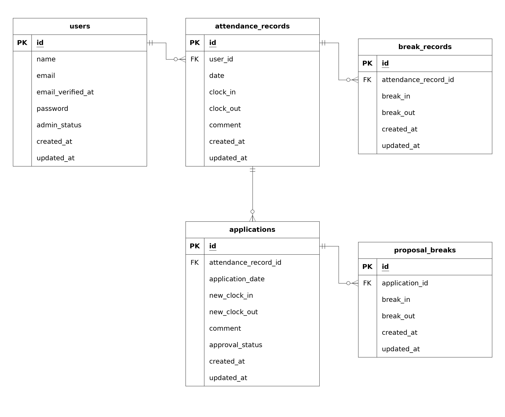

# coachtech 勤怠管理アプリ

企業内の勤怠管理を目的としたWebアプリケーションです。

一般ユーザーは出勤・退勤・休憩の打刻、勤怠情報の確認、勤怠修正申請などを行うことができます。

管理者は全ユーザーの勤怠確認・修正、ユーザーごとの勤怠確認、修正申請の承認などを行うことができます。

また、応用機能としてメール認証、月次勤怠CSV出力、マイ勤怠レポート、公開APIを実装しています。

## 作成者

竹村 麻紀

## 使用技術

### バックエンド

- PHP 8.2
- Laravel 10.x
- Laravel Fortify
- Laravel Sanctum

### データベース

- MySQL 8.4

### フロントエンド

- Blade
- CSS
- Vite

### 開発環境

- Docker
- Laravel Sail
- phpMyAdmin
- Mailpit

### テスト・コード品質

- PHPUnit
- Laravel Pint

## ER図



## 開発環境URL

- アプリケーション：http://localhost
- phpMyAdmin：http://localhost:8080
- Mailpit：http://localhost:8025

## 動作環境

- Docker
- Docker Compose

> ※Windowsの場合はWSL2の利用を推奨します。

## 環境構築手順

### 1. リポジトリをクローン

以下のコマンドで任意のディレクトリにリポジトリをクローンします。

```bash
git clone https://github.com/maki-takemura/attendance-app.git
cd attendance-app
```

### 2. envファイルの準備

`.env.example` をコピーして `.env` を作成します。

```bash
cp .env.example .env
```

`.env` ファイル内のDB接続情報を確認・設定します。

Laravel Sailを使用するため、以下のように変更してください。

```env
DB_CONNECTION=mysql
DB_HOST=mysql
DB_PORT=3306
DB_DATABASE=laravel
DB_USERNAME=sail
DB_PASSWORD=password
```

メール認証にはMailpitを使用します。

以下の設定になっていることを確認してください。

```env
MAIL_MAILER=smtp
MAIL_HOST=mailpit
MAIL_PORT=1025
MAIL_USERNAME=null
MAIL_PASSWORD=null
MAIL_ENCRYPTION=null
MAIL_FROM_ADDRESS="hello@example.com"
MAIL_FROM_NAME="${APP_NAME}"
```

### 3. Composer依存パッケージのインストール

初回セットアップ時は `vendor` ディレクトリが存在しないため、以下のDockerコマンドで `composer install` を実行します。

```bash
docker run --rm \
  -u "$(id -u):$(id -g)" \
  -v "$(pwd):/var/www/html" -w /var/www/html \
  -e COMPOSER_CACHE_DIR=/tmp/composer_cache \
  laravelsail/php82-composer:latest \
  composer install
```

### 4. Laravel Sailの起動

以下のコマンドでDockerコンテナを起動します。

```bash
./vendor/bin/sail up -d
```

> ※以降の手順で `sail` コマンドを使用するため、以下のエイリアスを設定してください。

#### Bash（Linux / WSL）の場合

```bash
echo "alias sail='[ -f sail ] && bash sail || bash vendor/bin/sail'" >> ~/.bashrc
exec $SHELL
```

#### Zsh（Mac）の場合

```bash
echo "alias sail='[ -f sail ] && bash sail || bash vendor/bin/sail'" >> ~/.zshrc
exec $SHELL
```

### 5. アプリケーションキーの作成

以下のコマンドでアプリケーションキーを作成します。

```bash
sail artisan key:generate
```

### 6. データベースのマイグレーションと初期データ投入

以下のコマンドでテーブルを作成し、ダミーデータを投入します。

```bash
sail artisan migrate:fresh --seed
```

#### マイグレーション実行時にデータベースのアクセスエラーが発生した場合

既存のDockerボリュームに以前のデータベース設定が残っている場合、マイグレーション実行時に `Access denied` エラーが発生することがあります。

その場合は、以下のコマンドを順に実行してください。

> ※ `sail down -v` を実行すると、本プロジェクトのDockerボリュームと保存されているデータベースのデータが削除されます。

```bash
sail down -v
sail up -d
```

MySQLコンテナが起動するまで30秒程度待ってから、再度マイグレーションと初期データ投入を実行してください。

```bash
sail artisan migrate:fresh --seed
```

### 7. フロントエンド環境の準備

以下のコマンドでフロントエンドの依存パッケージをインストールし、開発サーバーを起動します。

```bash
sail npm install
sail npm run dev
```

> `npm run dev` は開発中起動したままにする必要があります。別ターミナルで実行してください。

### 8. アプリケーションへのアクセス

ブラウザで以下にアクセスします。

http://localhost

### 9. テストユーザーでのログイン

Seederにより、動作確認用の一般ユーザー2名と管理者ユーザー1名が作成されます。

| 権限 | 名前 | メールアドレス | パスワード |
| --- | --- | --- | --- |
| 一般ユーザー | user1 | `user1@example.com` | `password` |
| 一般ユーザー | user2 | `user2@example.com` | `password` |
| 管理者 | user3 | `user3@example.com` | `password` |

#### 一般ユーザー

以下のURLからログインしてください。

http://localhost/login

#### 管理者ユーザー

以下のURLから管理者としてログインしてください。

http://localhost/admin/login

## テスト実行手順

本プロジェクトではPHPUnitを使用してFeatureテストを実施します。

### テスト実行

```bash
sail artisan test
```

すべてのテストが成功することを確認してください。

### コードフォーマット確認

Laravel Pintを使用してコードフォーマットを確認できます。

```bash
sail bin pint --test
```

## 機能一覧

### 一般ユーザー機能

- 会員登録
- ログイン・ログアウト
- メール認証
- 出勤打刻
- 退勤打刻
- 休憩開始・休憩終了
- 勤怠ステータス表示
- 月別勤怠一覧表示
- 勤怠詳細表示
- 勤怠修正申請
- 修正申請一覧表示
  - 承認待ち
  - 承認済み
- 修正申請詳細表示
- マイ勤怠レポート
  - 過去6ヶ月の総労働時間
  - 過去6ヶ月の総残業時間
  - 1日あたりの平均労働時間
  - 過去6ヶ月の月次推移
  - 遅刻回数
  - 早退回数
  - 長時間労働回数

### 管理者機能

- 管理者ログイン・ログアウト
- 日別勤怠一覧表示
- 勤怠詳細表示
- 勤怠情報の修正
- 一般ユーザー一覧表示
- ユーザー別月次勤怠一覧表示
- 月次勤怠CSV出力
- 修正申請一覧表示
  - 承認待ち
  - 承認済み
- 修正申請詳細表示
- 修正申請の承認

### 公開API

APIのベースURLは以下です。

```text
/api/v1
```

#### 読み取り

認証不要で利用できます。

| Method | Endpoint | 内容 |
| --- | --- | --- |
| GET | `/api/v1/attendance-records` | 勤怠一覧取得 |
| GET | `/api/v1/attendance-records/{attendanceRecord}` | 勤怠詳細取得 |

勤怠一覧は以下のクエリパラメータに対応しています。

- `user_id`
- `date`
- `month`
- `page`
- `per_page`

#### 書き込み

Laravel SanctumによるBearerトークン認証が必要です。

| Method | Endpoint | 内容 |
| --- | --- | --- |
| POST | `/api/v1/attendance-records` | 勤怠登録 |
| PUT | `/api/v1/attendance-records/{attendanceRecord}` | 勤怠更新 |
| PATCH | `/api/v1/attendance-records/{attendanceRecord}` | 勤怠部分更新 |
| DELETE | `/api/v1/attendance-records/{attendanceRecord}` | 勤怠削除 |

勤怠の更新・削除は、対象勤怠の本人または管理者のみ実行できます。

> 本アプリではAPIトークン発行用のエンドポイントは実装していません。

## 動作確認時の留意事項

### メール認証

メール認証メールはMailpitで確認できます。

http://localhost:8025

## 補足
実装にあたり、要件シート内および要件シートと提供Blade間で整合性が取れない点について
以下それぞれ確認と補完を行っています。


### 要件シート内、およびBladeとの不整合な点について運営様へ以下を確認済み

#### ■FN034の「全ユーザー」の対象範囲とダミーデータ作成範囲について

    運営様の回答：
    FN034 の「全ユーザー」は、管理者ユーザーも含みます。
    管理者ユーザーにも勤怠データを作成してください。

#### ■基本設計書のURLについて
Bladeに合わせてadmin/attendance/{id}→/attendance/{id}へ変更。

    運営様の回答：
    提供Bladeのとおり、同一のURIを使用する形を正としてください。

#### ■承認待ち時の表示文言についてBladeを正としてよいか

    運営様の回答：
    はい、その対応で問題ございません。

#### ■管理者の修正申請詳細画面に表示する内容について
FN050「申請詳細取得機能」には、「正しく実際の打刻内容が反映されていること」とあるが、
修正申請された値を表示する認識でよいか

    運営様の回答：
    はい、修正申請された値を表示する認識で問題ございません

#### ■公開APIについて

1. SanctumのAPIトークン発行方法について、トークン発行エンドポイントは不要で、テスト上 Sanctum::actingAs() によって認証を再現できれば要件を満たす想定か
2. 勤怠更新APIのHTTPメソッドについて、エンドポイント一覧にはPATCHがないが、対応する想定でよいか
3. 勤怠更新APIのルートパラメータ名の表記揺れについて

    運営様の回答：
    1. トークンを発行するエンドポイントは不要で、テストで Sanctum::actingAs() により認証を再現できれば問題ございません。
    2. PUT・PATCH の両方に対応してください。
    3. {attendanceRecord} を正としてください。

### 要件シート内、およびBladeとの不整合な点について担当コーチへ以下を確認済み
#### ■基本設計書のURLについて
Bladeに合わせて/attendance/detail/{id}→/attendance/{id}へ変更。

#### ■メール再送時のフラッシュメッセージについて
メッセージの指定がないため実装はなしでよい

### 上記の点を含む実装に必要と判断した補完内容

#### ■一般ユーザーログイン画面の対象
管理者ユーザーも勤怠データを持つことから、管理者ユーザーもログインできるよう設計

#### ■テーブル名についてbreakが予約語であることからモデル名として避け、かつ
Laravelの自動紐づけを利用するためテーブル名はbreak_recordsとしたため
要件シートとは整合しない。Laravelは設定より規約という原則に基づき判断。

#### ■フラッシュメッセージについて
register.blade.phpにフラッシュメッセージの表示領域があるが、登録後に遷移する導線がないため未実装とした。
また認証完了後に表示される attendance-register.blade.php には
フラッシュメッセージの表示領域がないため、登録完了メッセージは未実装とした。

#### ■Viteのpublicディレクトリ設定
勤怠一覧画面で使用している /images/calender.png、/images/arrow.png を
Vite開発サーバーから参照できるよう、vite.config.js を修正


#### ■修正申請中の勤怠詳細表示について

resources/views/admin下には要件シートで指定されている
承認待ち修正不可に関するメッセージが含まれているBladeがなかったため、
厳密には管理者専用の画面ではないが、該当の文言が記載されているresources/views/user下の該当画面を表示。

#### ■提供Bladeのリレーションメソッド名について

提供Bladeに命名規則に沿わない `AttendanceRecord()` の表記があったため、
バックエンド側では Laravel の命名規則に沿って `attendanceRecord()` として実装。

#### ■テストケース一覧の表記ゆれについて
ID6において「勤務中」と表記が揺れているが「出勤中」へ統一
ID9/14「翌月」を押下した時に表示月の前の情報が表示される→翌月に修正
ID11エラーメッセージ「出勤時間が不適切な値です」→「出勤時間もしくは退勤時間が不適切な値です」

#### ■UpdateAttendanceRecordRequest
Update用FormRequestの仕様書記載に不整合あり。
・$this->user_id → 更新対象勤怠の $attendanceRecord->user_id を使用
理由：Updateのリクエストには user_id を含めないため
user_id × date の重複禁止、自身のレコード除外という仕様意図は維持
